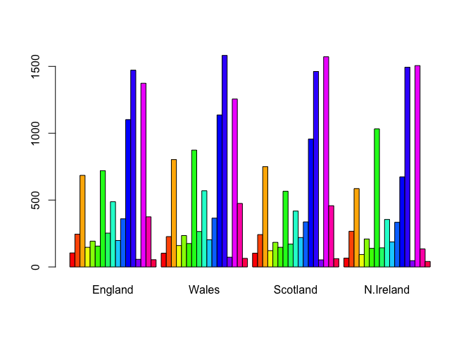

Class 8: Unsupervised Machine Learning
================
Madeline R. Luth
4/26/2019

K-means clustering
------------------

Want the smallest within cluster sum of squares Will always return the number of groups (k) you ask for, even if a different number of groups would be "better" for the dataset Can determine optimal k value using a "scree plot"

``` r
# k-means algorithm with 3 centers, run 20 times, example code (commented out so it doesn't run, since you would need to generate x first):

#kmeans(x, centers= 3, nstart= 20)

# x is the data (matrix or dataframe), centers is # of groups, nstart is # of iterations
```

**Lecture Example**

``` r
# Generate some example data for clustering
tmp <- c(rnorm(30,-3), rnorm(30,3))
# 30 random numbers with mean of -3, another 30 random numbers with mean of 3
x <- cbind(x=tmp, y=rev(tmp))
# bind the two vectors, but the "rev" version will be reversed
plot(x)
```


*Instructions:*

Use the kmeans() function setting k to 2 and nstart=20 Inspect/print the results

> Q. How many points are in each cluster? Q. What ‘component’ of your result object details - cluster size? - cluster assignment/membership? - cluster center? Plot x colored by the kmeans cluster assignment and add cluster centers as blue points

``` r
km <- kmeans( x, centers = 2, nstart = 20 )
km
```

    ## K-means clustering with 2 clusters of sizes 30, 30
    ## 
    ## Cluster means:
    ##           x         y
    ## 1 -3.063806  2.757827
    ## 2  2.757827 -3.063806
    ## 
    ## Clustering vector:
    ##  [1] 1 1 1 1 1 1 1 1 1 1 1 1 1 1 1 1 1 1 1 1 1 1 1 1 1 1 1 1 1 1 2 2 2 2 2
    ## [36] 2 2 2 2 2 2 2 2 2 2 2 2 2 2 2 2 2 2 2 2 2 2 2 2 2
    ## 
    ## Within cluster sum of squares by cluster:
    ## [1] 59.49101 59.49101
    ##  (between_SS / total_SS =  89.5 %)
    ## 
    ## Available components:
    ## 
    ## [1] "cluster"      "centers"      "totss"        "withinss"    
    ## [5] "tot.withinss" "betweenss"    "size"         "iter"        
    ## [9] "ifault"

Can view available components, look at help page for kmeans() to determine

> Q. How many points are in each cluster?

``` r
km$size
```

    ## [1] 30 30

There are 30 points in each cluster.

> Q. What ‘component’ of your result object details - cluster size? "size": also the first line of the returned info

``` r
km$size
```

    ## [1] 30 30

      - cluster assignment/membership?
      "cluster":A vector of integers (from 1:k) indicating the cluster to which each point is allocated.

``` r
km$cluster
```

    ##  [1] 1 1 1 1 1 1 1 1 1 1 1 1 1 1 1 1 1 1 1 1 1 1 1 1 1 1 1 1 1 1 2 2 2 2 2
    ## [36] 2 2 2 2 2 2 2 2 2 2 2 2 2 2 2 2 2 2 2 2 2 2 2 2 2

      - cluster center?
      Shown above in the "Cluster means"

``` r
km$centers
```

    ##           x         y
    ## 1 -3.063806  2.757827
    ## 2  2.757827 -3.063806

Generate a plot

``` r
plot(x, col=km$cluster)
points(km$centers, col = "blue", pch = 18, cex = 3)
```


Hierarchical clustering
-----------------------

Main difference is that the number of clusters is not known ahead of time, so we don't have to indicate a number of k clusters.

**The input to R must be a distance matrix of our data (x)**

``` r
# First we need to calculate point (dis)similarity
#   as the Euclidean distance between observations
d <- dist_matrix <- dist(x)
# The hclust() function returns a hierarchical
#  clustering model
hc <- hclust(d = dist_matrix)
# the print method is not so useful here
hc
```

    ## 
    ## Call:
    ## hclust(d = dist_matrix)
    ## 
    ## Cluster method   : complete 
    ## Distance         : euclidean 
    ## Number of objects: 60

Not a lot of information given here. Let's plot the results to get a better idea of the result.

``` r
plot(hc)
```


The result is a cluster dendrogram. There are 2 major groups (as expected based on our original data input).

``` r
plot(hc)
abline( h=6, col = "red")
```


``` r
cutree(hc, h = 6)
```

    ##  [1] 1 1 1 1 1 1 1 1 1 1 1 1 1 1 1 1 1 1 1 1 1 1 1 1 1 1 1 1 1 1 2 2 2 2 2
    ## [36] 2 2 2 2 2 2 2 2 2 2 2 2 2 2 2 2 2 2 2 2 2 2 2 2 2

``` r
gp2 <- cutree(hc, k = 2)
gp2
```

    ##  [1] 1 1 1 1 1 1 1 1 1 1 1 1 1 1 1 1 1 1 1 1 1 1 1 1 1 1 1 1 1 1 2 2 2 2 2
    ## [36] 2 2 2 2 2 2 2 2 2 2 2 2 2 2 2 2 2 2 2 2 2 2 2 2 2

``` r
gp3<- cutree(hc, k =3)
gp3
```

    ##  [1] 1 1 1 1 1 1 1 1 1 1 1 1 1 1 1 1 1 1 1 1 1 1 1 1 1 1 1 1 1 1 2 3 3 2 3
    ## [36] 2 3 2 3 3 3 2 3 3 3 3 2 2 3 3 2 3 3 2 3 3 2 3 3 3

``` r
table(gp2)
```

    ## gp2
    ##  1  2 
    ## 30 30

``` r
table(gp3)
```

    ## gp3
    ##  1  2  3 
    ## 30 10 20

``` r
table(gp2, gp3)
```

    ##    gp3
    ## gp2  1  2  3
    ##   1 30  0  0
    ##   2  0 10 20

There are 4 different methods to determine distance between clusters: complete (default), single, average, and centroid

Centroid is not used very often - gives weird looking trees

Clustering methods on more complicated data
-------------------------------------------

Intentionally more "dirty" data to simulate what clustering looks like for real datasets

``` r
# Step 1. Generate some example data for clustering
x <- rbind(
  matrix(rnorm(100, mean=0, sd = 0.3), ncol = 2),   # c1
  matrix(rnorm(100, mean = 1, sd = 0.3), ncol = 2), # c2
  matrix(c(rnorm(50, mean = 1, sd = 0.3),           # c3
           rnorm(50, mean = 0, sd = 0.3)), ncol = 2))
colnames(x) <- c("x", "y")
# Step 2. Plot the data without clustering
plot(x)
```


``` r
# Step 3. Generate colors for known clusters
#         (just so we can compare to hclust results)
col <- as.factor( rep(c("c1","c2","c3"), each=50) )
plot(x, col=col)
```


**Instructions:**

> Q. Use the dist(), hclust(), plot() and cutree() functions to return 2 and 3 clusters Q. How does this compare to your known 'col' groups?

``` r
#   as the Euclidean distance between observations
hc2 <- hclust( dist(x) )
# the print method is not so useful here
plot(hc2)
abline( h =2.0, col = "red")
```


``` r
# This would cut into 3 groups (Prof's data cut at h = 1.7 to give 3 groups, if I cut there it would give 4 groups)
```

``` r
gp2.2 <- cutree( hc2, k=2 )
gp3.2 <- cutree( hc2, k=3 )

table(gp2.2)
```

    ## gp2.2
    ##   1   2 
    ##  50 100

``` r
table(gp3.2)
```

    ## gp3.2
    ##  1  2  3 
    ## 50 36 64

``` r
plot(x, col = gp3.2)
```


Principal Component Analysis (PCA)
----------------------------------

The PCs (i.e. new plot axis) are ranked by their importance. So, PC1 is more important than PC2, which in turn is more important than PC3, etc. The PCs are ranked by the amount of variance in the original data (i.e. gene expression values) that they “capture”

We actually get two main things out of a typical PCA: The new axis (called PCs or Eigenvectors) and Eigenvalues that detail the amount of variance captured by each PC.

PC Loadings: a quantitive report on how the original variables contributed to each PC, or in other words, which genes were most important to the observed clustering

Look at the following tutorial/guide to become more familiar with how PCA works: <https://bioboot.github.io/bggn213_W19/class-material/pca/>

**Lecture Example**

Note: there are many better PCA packages available in R, but today we will use base R **prcomp()** function.

The following example is from an RNAseq experiment.

``` r
## You can also download this file from the class website
mydata <- read.csv("https://tinyurl.com/expression-CSV",
row.names=1)
head(mydata)
```

    ##        wt1 wt2  wt3  wt4 wt5 ko1 ko2 ko3 ko4 ko5
    ## gene1  439 458  408  429 420  90  88  86  90  93
    ## gene2  219 200  204  210 187 427 423 434 433 426
    ## gene3 1006 989 1030 1017 973 252 237 238 226 210
    ## gene4  783 792  829  856 760 849 856 835 885 894
    ## gene5  181 249  204  244 225 277 305 272 270 279
    ## gene6  460 502  491  491 493 612 594 577 618 638

``` r
# NOTE: the samples are columns, and the genes are rows
```

There are 100 in this dataset. We can also see that there are wildtype and knockout lines being tested.

``` r
 # lets do PCA
 pca <- prcomp(t(mydata), scale=TRUE)

 # Note: R expects the genes to be columns, and the samples to be in the rows, so we used t() to transpose the data first

 # See what is returned by the prcomp() function
 summary(pca)
```

    ## Importance of components:
    ##                           PC1    PC2     PC3     PC4     PC5     PC6
    ## Standard deviation     9.6237 1.5198 1.05787 1.05203 0.88062 0.82545
    ## Proportion of Variance 0.9262 0.0231 0.01119 0.01107 0.00775 0.00681
    ## Cumulative Proportion  0.9262 0.9493 0.96045 0.97152 0.97928 0.98609
    ##                            PC7     PC8     PC9      PC10
    ## Standard deviation     0.80111 0.62065 0.60342 3.348e-15
    ## Proportion of Variance 0.00642 0.00385 0.00364 0.000e+00
    ## Cumulative Proportion  0.99251 0.99636 1.00000 1.000e+00

Proportion of variance shows how much the PC is influencing overall variance, i.e PC1 explains 92.62% of the variance, and PC2 explains 2.31%.

``` r
attributes(pca)
```

    ## $names
    ## [1] "sdev"     "rotation" "center"   "scale"    "x"       
    ## 
    ## $class
    ## [1] "prcomp"

The returned pca$x here contains the principal components (PCs) for drawing our first graph.

Let's make the PCA plot.

``` r
#This is PCA1 on x axis vs. PCA2 on y axis (columns 1 and 2 of attribute x)
plot( pca$x[,1], pca$x[,2] )
```


Nice separation of samples into two groups of 5 samples each

``` r
## Percent variance captured per PC
pca.var <- pca$sdev^2
pca.var.per <- round(pca.var/sum(pca.var)*100, 1)

pca.var.per
```

    ##  [1] 92.6  2.3  1.1  1.1  0.8  0.7  0.6  0.4  0.4  0.0

``` r
#Make a nicer plot with our percent variance per PCA indicated on the axes
xlab <- paste("PC1 (",pca.var.per[1], "%)", sep = "" )
ylab <- paste("PC2 (",pca.var.per[2], "%)", sep = "" )

plot( pca$x[,1], pca$x[,2], xlab = xlab, ylab = ylab )

#adds sample name "wt1, ko1, etc" onto corresponding point
text( pca$x[,1], pca$x[,2], colnames(mydata))
```


Hands-on with Principal Component Analysis (PCA)
------------------------------------------------

Find the assignment here: <https://bioboot.github.io/bggn213_W19/class-material/lab-8-bggn213.html>

**Perform a PCA on the UK food data**

``` r
x <- read.csv("https://bioboot.github.io/bggn213_f17/class-material/UK_foods.csv", row.names = 1)
```

**Q1. How many rows and columns are in your new data frame named x? What R functions could you use to answer this questions?**

``` r
head(x)
```

    ##                England Wales Scotland N.Ireland
    ## Cheese             105   103      103        66
    ## Carcass_meat       245   227      242       267
    ## Other_meat         685   803      750       586
    ## Fish               147   160      122        93
    ## Fats_and_oils      193   235      184       209
    ## Sugars             156   175      147       139

``` r
nrow(x)
```

    ## [1] 17

``` r
ncol(x)
```

    ## [1] 4

There are 17 rows (each row is a food type) and 5 columns (4 of which are countries in the UK). Will need to fix the columns, see below:

\*\*Note: went back and corrected from read.csv() so this command is now commented out.

``` r
#rownames(x) <- x[,1]
#x <- x[,-1]
#head(x)
```

Now, the dataset is properly sorted.

**Q2. Which approach to solving the ‘row-names problem’ mentioned above do you prefer and why? Is one approach more robust than another under certain circumstances?**

x &lt;- read.csv("data/UK\_foods.csv", row.names=1) is better than rownames(x) &lt;- x\[,1\] then x &lt;- x\[,-1\] because if you run the second command multiple times you'll keep slicing off rows of data. Appending read.csv is safer because you set the exact row to be the column names.

``` r
# Make a barplot
barplot(as.matrix(x), beside=T, col=rainbow(nrow(x)))
```



**Q3: Changing what optional argument in the above barplot() function results in the following plot? (See document and barplot below)**

``` r
#Change the "beside" argument
barplot(as.matrix(x), beside=F, col=rainbow(nrow(x)))
```


From the barplot() documentation: Beside is a logical value. If FALSE, the columns of height are portrayed as stacked bars, and if TRUE the columns are portrayed as juxtaposed bars.

**Q4: Generating all pairwise plots may help somewhat. Can you make sense of the following code and resulting figure? What does it mean if a given point lies on the diagonal for a given plot?**

``` r
#generates a matrix of scatterplots
pairs(x, col=rainbow(10), pch=16)
```

 If values are on diagonal, they are the same between the two pairs. Can see a pattern in plots with Northern Ireland (points that deviate more from the diagonal).

**Q6. What is the main differences between N. Ireland and the other countries of the UK in terms of this data-set?**

Will need to generate a PCA plot to determine what the difference is.

``` r
pca <- prcomp( t(x) )
summary(pca)
```

    ## Importance of components:
    ##                             PC1      PC2      PC3       PC4
    ## Standard deviation     324.1502 212.7478 73.87622 4.189e-14
    ## Proportion of Variance   0.6744   0.2905  0.03503 0.000e+00
    ## Cumulative Proportion    0.6744   0.9650  1.00000 1.000e+00

**Q7. Complete the code below to generate a plot of PC1 vs PC2. The second line adds text labels over the data points.**

``` r
# Plot PC1 vs PC2
plot(pca$x[,1], pca$x[,2], xlab="PC1", ylab="PC2", xlim=c(-270,500))
text(pca$x[,1], pca$x[,2], colnames(x))
```


**Q8. Customize your plot so that the colors of the country names match the colors in our UK and Ireland map and table at start of this document.**

``` r
mycols <- c("orange", "red", "blue", "darkgreen")
plot(pca$x[,1], pca$x[,2], xlab="PC1", ylab="PC2", xlim=c(-270,500))
text(pca$x[,1], pca$x[,2], colnames(x), col = mycols)

#The ablines at 0 represent the mean
abline(h=0, col="gray", lty=2)
abline(v=0, col="gray", lty=2)
```


``` r
# how much variation each PC contributes to
v <- round( pca$sdev^2/sum(pca$sdev^2) * 100 )
v
```

    ## [1] 67 29  4  0

``` r
#plot these variances
barplot(v, xlab="Principal Component", ylab="Percent Variation")
```


\*\*Look at PC Loadings

``` r
## Lets focus on PC1 as it accounts for > 90% of variance 
par(mar=c(10, 3, 0.35, 0))
barplot( pca$rotation[,1], las=2 )
```


