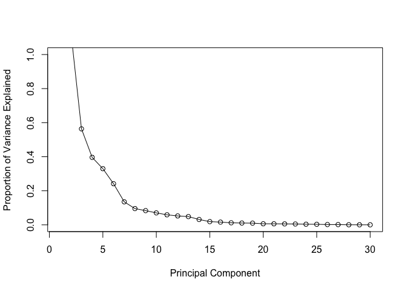
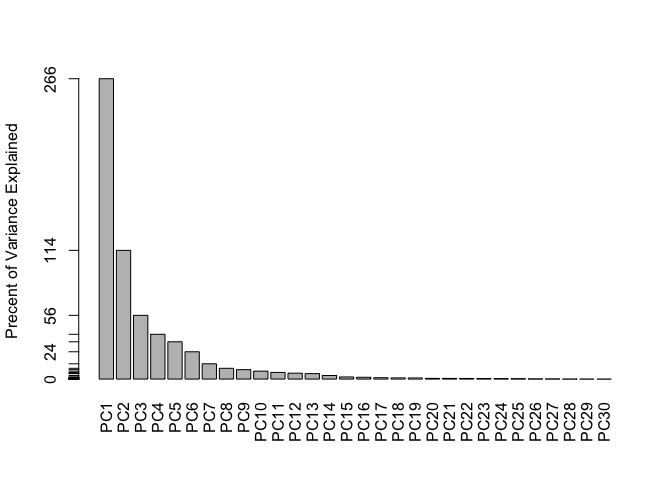

Class09 Interactive Session: Unsupervised Learning Analysis of Human Breast Cancer Cells
================
Madeline R. Luth
5/1/2019

Background Information
----------------------

The full session instructions can be accessed at: <https://bioboot.github.io/bggn213_S19/class-material/lab-9-bggn213-WEBX.html#7_prediction>

The goal of this hands-on session is to explore a complete analysis using the unsupervised learning techniques covered in the last class. Extend what you’ve learned by combining PCA as a preprocessing step to clustering using data that consist of measurements of cell nuclei of human breast masses. This expands on our RNA-Seq analysis from last day.

The data itself comes from the Wisconsin Breast Cancer Diagnostic Data Set first reported by K. P. Benne and O. L. Mangasarian: “Robust Linear Programming Discrimination of Two Linearly Inseparable Sets”.

Exploratory Data Analysis
-------------------------

``` r
# read the data in
wisc.df <- read.csv("https://bioboot.github.io/bggn213_W19/class-material/WisconsinCancer.csv")
```

There are 569 patients in the dataset (\# of observations). Can also be determined using nrow().

``` r
head(wisc.df)
```

    ##         id diagnosis radius_mean texture_mean perimeter_mean area_mean
    ## 1   842302         M       17.99        10.38         122.80    1001.0
    ## 2   842517         M       20.57        17.77         132.90    1326.0
    ## 3 84300903         M       19.69        21.25         130.00    1203.0
    ## 4 84348301         M       11.42        20.38          77.58     386.1
    ## 5 84358402         M       20.29        14.34         135.10    1297.0
    ## 6   843786         M       12.45        15.70          82.57     477.1
    ##   smoothness_mean compactness_mean concavity_mean concave.points_mean
    ## 1         0.11840          0.27760         0.3001             0.14710
    ## 2         0.08474          0.07864         0.0869             0.07017
    ## 3         0.10960          0.15990         0.1974             0.12790
    ## 4         0.14250          0.28390         0.2414             0.10520
    ## 5         0.10030          0.13280         0.1980             0.10430
    ## 6         0.12780          0.17000         0.1578             0.08089
    ##   symmetry_mean fractal_dimension_mean radius_se texture_se perimeter_se
    ## 1        0.2419                0.07871    1.0950     0.9053        8.589
    ## 2        0.1812                0.05667    0.5435     0.7339        3.398
    ## 3        0.2069                0.05999    0.7456     0.7869        4.585
    ## 4        0.2597                0.09744    0.4956     1.1560        3.445
    ## 5        0.1809                0.05883    0.7572     0.7813        5.438
    ## 6        0.2087                0.07613    0.3345     0.8902        2.217
    ##   area_se smoothness_se compactness_se concavity_se concave.points_se
    ## 1  153.40      0.006399        0.04904      0.05373           0.01587
    ## 2   74.08      0.005225        0.01308      0.01860           0.01340
    ## 3   94.03      0.006150        0.04006      0.03832           0.02058
    ## 4   27.23      0.009110        0.07458      0.05661           0.01867
    ## 5   94.44      0.011490        0.02461      0.05688           0.01885
    ## 6   27.19      0.007510        0.03345      0.03672           0.01137
    ##   symmetry_se fractal_dimension_se radius_worst texture_worst
    ## 1     0.03003             0.006193        25.38         17.33
    ## 2     0.01389             0.003532        24.99         23.41
    ## 3     0.02250             0.004571        23.57         25.53
    ## 4     0.05963             0.009208        14.91         26.50
    ## 5     0.01756             0.005115        22.54         16.67
    ## 6     0.02165             0.005082        15.47         23.75
    ##   perimeter_worst area_worst smoothness_worst compactness_worst
    ## 1          184.60     2019.0           0.1622            0.6656
    ## 2          158.80     1956.0           0.1238            0.1866
    ## 3          152.50     1709.0           0.1444            0.4245
    ## 4           98.87      567.7           0.2098            0.8663
    ## 5          152.20     1575.0           0.1374            0.2050
    ## 6          103.40      741.6           0.1791            0.5249
    ##   concavity_worst concave.points_worst symmetry_worst
    ## 1          0.7119               0.2654         0.4601
    ## 2          0.2416               0.1860         0.2750
    ## 3          0.4504               0.2430         0.3613
    ## 4          0.6869               0.2575         0.6638
    ## 5          0.4000               0.1625         0.2364
    ## 6          0.5355               0.1741         0.3985
    ##   fractal_dimension_worst  X
    ## 1                 0.11890 NA
    ## 2                 0.08902 NA
    ## 3                 0.08758 NA
    ## 4                 0.17300 NA
    ## 5                 0.07678 NA
    ## 6                 0.12440 NA

``` r
table(wisc.df$diagnosis)
```

    ## 
    ##   B   M 
    ## 357 212

There are 212 malignant diagnoses and 357 benign.

Can also use filter feature in the R Studio global environment.

``` r
length(grep("_mean", colnames(wisc.df)))
```

    ## [1] 10

There are 10 features in the data that are suffixed with "\_mean".

``` r
# read in only columns 3-32 (there are NAs at the end of the file and we don't need ID and diagnosis string values in this analysis)
wisc.data <- as.matrix(wisc.df[,3:32])
```

``` r
# Set the row names of wisc.data
row.names(wisc.data) <- wisc.df$id
head(wisc.data)
```

    ##          radius_mean texture_mean perimeter_mean area_mean smoothness_mean
    ## 842302         17.99        10.38         122.80    1001.0         0.11840
    ## 842517         20.57        17.77         132.90    1326.0         0.08474
    ## 84300903       19.69        21.25         130.00    1203.0         0.10960
    ## 84348301       11.42        20.38          77.58     386.1         0.14250
    ## 84358402       20.29        14.34         135.10    1297.0         0.10030
    ## 843786         12.45        15.70          82.57     477.1         0.12780
    ##          compactness_mean concavity_mean concave.points_mean symmetry_mean
    ## 842302            0.27760         0.3001             0.14710        0.2419
    ## 842517            0.07864         0.0869             0.07017        0.1812
    ## 84300903          0.15990         0.1974             0.12790        0.2069
    ## 84348301          0.28390         0.2414             0.10520        0.2597
    ## 84358402          0.13280         0.1980             0.10430        0.1809
    ## 843786            0.17000         0.1578             0.08089        0.2087
    ##          fractal_dimension_mean radius_se texture_se perimeter_se area_se
    ## 842302                  0.07871    1.0950     0.9053        8.589  153.40
    ## 842517                  0.05667    0.5435     0.7339        3.398   74.08
    ## 84300903                0.05999    0.7456     0.7869        4.585   94.03
    ## 84348301                0.09744    0.4956     1.1560        3.445   27.23
    ## 84358402                0.05883    0.7572     0.7813        5.438   94.44
    ## 843786                  0.07613    0.3345     0.8902        2.217   27.19
    ##          smoothness_se compactness_se concavity_se concave.points_se
    ## 842302        0.006399        0.04904      0.05373           0.01587
    ## 842517        0.005225        0.01308      0.01860           0.01340
    ## 84300903      0.006150        0.04006      0.03832           0.02058
    ## 84348301      0.009110        0.07458      0.05661           0.01867
    ## 84358402      0.011490        0.02461      0.05688           0.01885
    ## 843786        0.007510        0.03345      0.03672           0.01137
    ##          symmetry_se fractal_dimension_se radius_worst texture_worst
    ## 842302       0.03003             0.006193        25.38         17.33
    ## 842517       0.01389             0.003532        24.99         23.41
    ## 84300903     0.02250             0.004571        23.57         25.53
    ## 84348301     0.05963             0.009208        14.91         26.50
    ## 84358402     0.01756             0.005115        22.54         16.67
    ## 843786       0.02165             0.005082        15.47         23.75
    ##          perimeter_worst area_worst smoothness_worst compactness_worst
    ## 842302            184.60     2019.0           0.1622            0.6656
    ## 842517            158.80     1956.0           0.1238            0.1866
    ## 84300903          152.50     1709.0           0.1444            0.4245
    ## 84348301           98.87      567.7           0.2098            0.8663
    ## 84358402          152.20     1575.0           0.1374            0.2050
    ## 843786            103.40      741.6           0.1791            0.5249
    ##          concavity_worst concave.points_worst symmetry_worst
    ## 842302            0.7119               0.2654         0.4601
    ## 842517            0.2416               0.1860         0.2750
    ## 84300903          0.4504               0.2430         0.3613
    ## 84348301          0.6869               0.2575         0.6638
    ## 84358402          0.4000               0.1625         0.2364
    ## 843786            0.5355               0.1741         0.3985
    ##          fractal_dimension_worst
    ## 842302                   0.11890
    ## 842517                   0.08902
    ## 84300903                 0.08758
    ## 84348301                 0.17300
    ## 84358402                 0.07678
    ## 843786                   0.12440

``` r
# create diagnosis vector for later
diagnosis <- wisc.df$diagnosis
head(diagnosis)
```

    ## [1] M M M M M M
    ## Levels: B M

Principal Component Analysis
----------------------------

The next step in your analysis is to perform principal component analysis (PCA) on wisc.data.

It is important to check if the data need to be scaled before performing PCA. Recall two common reasons for scaling data include:

The input variables use different units of measurement. The input variables have significantly different variances.

``` r
# Check column means and standard deviations
colMeans(wisc.data)
```

    ##             radius_mean            texture_mean          perimeter_mean 
    ##            1.412729e+01            1.928965e+01            9.196903e+01 
    ##               area_mean         smoothness_mean        compactness_mean 
    ##            6.548891e+02            9.636028e-02            1.043410e-01 
    ##          concavity_mean     concave.points_mean           symmetry_mean 
    ##            8.879932e-02            4.891915e-02            1.811619e-01 
    ##  fractal_dimension_mean               radius_se              texture_se 
    ##            6.279761e-02            4.051721e-01            1.216853e+00 
    ##            perimeter_se                 area_se           smoothness_se 
    ##            2.866059e+00            4.033708e+01            7.040979e-03 
    ##          compactness_se            concavity_se       concave.points_se 
    ##            2.547814e-02            3.189372e-02            1.179614e-02 
    ##             symmetry_se    fractal_dimension_se            radius_worst 
    ##            2.054230e-02            3.794904e-03            1.626919e+01 
    ##           texture_worst         perimeter_worst              area_worst 
    ##            2.567722e+01            1.072612e+02            8.805831e+02 
    ##        smoothness_worst       compactness_worst         concavity_worst 
    ##            1.323686e-01            2.542650e-01            2.721885e-01 
    ##    concave.points_worst          symmetry_worst fractal_dimension_worst 
    ##            1.146062e-01            2.900756e-01            8.394582e-02

``` r
apply(wisc.data,2,sd)
```

    ##             radius_mean            texture_mean          perimeter_mean 
    ##            3.524049e+00            4.301036e+00            2.429898e+01 
    ##               area_mean         smoothness_mean        compactness_mean 
    ##            3.519141e+02            1.406413e-02            5.281276e-02 
    ##          concavity_mean     concave.points_mean           symmetry_mean 
    ##            7.971981e-02            3.880284e-02            2.741428e-02 
    ##  fractal_dimension_mean               radius_se              texture_se 
    ##            7.060363e-03            2.773127e-01            5.516484e-01 
    ##            perimeter_se                 area_se           smoothness_se 
    ##            2.021855e+00            4.549101e+01            3.002518e-03 
    ##          compactness_se            concavity_se       concave.points_se 
    ##            1.790818e-02            3.018606e-02            6.170285e-03 
    ##             symmetry_se    fractal_dimension_se            radius_worst 
    ##            8.266372e-03            2.646071e-03            4.833242e+00 
    ##           texture_worst         perimeter_worst              area_worst 
    ##            6.146258e+00            3.360254e+01            5.693570e+02 
    ##        smoothness_worst       compactness_worst         concavity_worst 
    ##            2.283243e-02            1.573365e-01            2.086243e-01 
    ##    concave.points_worst          symmetry_worst fractal_dimension_worst 
    ##            6.573234e-02            6.186747e-02            1.806127e-02

The data need to be scaled prior to generating PCA.

``` r
# Perform PCA on wisc.data
wisc.pr <- prcomp(wisc.data, scale. = TRUE)
summary(wisc.pr)
```

    ## Importance of components:
    ##                           PC1    PC2     PC3     PC4     PC5     PC6
    ## Standard deviation     3.6444 2.3857 1.67867 1.40735 1.28403 1.09880
    ## Proportion of Variance 0.4427 0.1897 0.09393 0.06602 0.05496 0.04025
    ## Cumulative Proportion  0.4427 0.6324 0.72636 0.79239 0.84734 0.88759
    ##                            PC7     PC8    PC9    PC10   PC11    PC12
    ## Standard deviation     0.82172 0.69037 0.6457 0.59219 0.5421 0.51104
    ## Proportion of Variance 0.02251 0.01589 0.0139 0.01169 0.0098 0.00871
    ## Cumulative Proportion  0.91010 0.92598 0.9399 0.95157 0.9614 0.97007
    ##                           PC13    PC14    PC15    PC16    PC17    PC18
    ## Standard deviation     0.49128 0.39624 0.30681 0.28260 0.24372 0.22939
    ## Proportion of Variance 0.00805 0.00523 0.00314 0.00266 0.00198 0.00175
    ## Cumulative Proportion  0.97812 0.98335 0.98649 0.98915 0.99113 0.99288
    ##                           PC19    PC20   PC21    PC22    PC23   PC24
    ## Standard deviation     0.22244 0.17652 0.1731 0.16565 0.15602 0.1344
    ## Proportion of Variance 0.00165 0.00104 0.0010 0.00091 0.00081 0.0006
    ## Cumulative Proportion  0.99453 0.99557 0.9966 0.99749 0.99830 0.9989
    ##                           PC25    PC26    PC27    PC28    PC29    PC30
    ## Standard deviation     0.12442 0.09043 0.08307 0.03987 0.02736 0.01153
    ## Proportion of Variance 0.00052 0.00027 0.00023 0.00005 0.00002 0.00000
    ## Cumulative Proportion  0.99942 0.99969 0.99992 0.99997 1.00000 1.00000

From your results, what proportion of the original variance is captured by the first principal components (PC1)?

0.4427

How many principal components (PCs) are required to describe at least 70% of the original variance in the data?

3

How many principal components (PCs) are required to describe at least 90% of the original variance in the data?

7

``` r
biplot(wisc.pr)
```


This plot is generally uninformative. Will need to make a better one.

``` r
#plot PC1 and PC2
plot(wisc.pr$x[,1], wisc.pr$x[,2], xlab="PC1", ylab="PC2", col = diagnosis)
```


``` r
# Plot PC1 and PC3
plot(wisc.pr$x[,1], wisc.pr$x[,3], xlab="PC1", ylab="PC3", col = diagnosis)
```


Because principal component 2 explains more variance in the original data than principal component 3, you can see that the first plot has a cleaner cut separating the two subgroups.

Overall, the plots indicate that principal component 1 is capturing a separation of malignant from benign samples.

``` r
# Calculate variance of each component
pr.var <- wisc.pr$sdev^2
head(pr.var)
```

    ## [1] 13.281608  5.691355  2.817949  1.980640  1.648731  1.207357

Calculate the variance explained by each principal component by dividing by the total variance explained of all principal components. Assign this to a variable called pve and create a plot of variance explained for each principal component.

``` r
# Variance explained by each principal component: pve
pve <- pr.var / length(wisc.pr)

# Plot variance explained for each principal component
plot(pve, xlab = "Principal Component", 
     ylab = "Proportion of Variance Explained", 
     ylim = c(0, 1), type = "o")
```



``` r
# Alternative scree plot of the same data, note data driven y-axis
barplot(pve, ylab = "Precent of Variance Explained",
     names.arg=paste0("PC",1:length(pve)), las=2, axes = FALSE)
axis(2, at=pve, labels=round(pve,2)*100 )
```



There are quite a few CRAN packages that are helpful for PCA. This includes the factoextra package. For example:

``` r
## ggplot based graph
#install.packages("factoextra")
library(factoextra)
```

    ## Loading required package: ggplot2

    ## Welcome! Related Books: `Practical Guide To Cluster Analysis in R` at https://goo.gl/13EFCZ

``` r
fviz_eig(wisc.pr, addlabels = TRUE)
```


``` r
# Access the contribution of one variable on PC1 
wisc.pr$rotation["concave.points_mean",1]
```

    ## [1] -0.2608538

``` r
# Sort the loadings values by their absolute contribution to PC1
sort( abs(wisc.pr$rotation[,1]) )
```

    ##           smoothness_se              texture_se             symmetry_se 
    ##              0.01453145              0.01742803              0.04249842 
    ##  fractal_dimension_mean    fractal_dimension_se            texture_mean 
    ##              0.06436335              0.10256832              0.10372458 
    ##           texture_worst          symmetry_worst        smoothness_worst 
    ##              0.10446933              0.12290456              0.12795256 
    ## fractal_dimension_worst           symmetry_mean         smoothness_mean 
    ##              0.13178394              0.13816696              0.14258969 
    ##            concavity_se          compactness_se       concave.points_se 
    ##              0.15358979              0.17039345              0.18341740 
    ##                 area_se               radius_se       compactness_worst 
    ##              0.20286964              0.20597878              0.21009588 
    ##            perimeter_se             radius_mean               area_mean 
    ##              0.21132592              0.21890244              0.22099499 
    ##              area_worst          perimeter_mean            radius_worst 
    ##              0.22487053              0.22753729              0.22799663 
    ##         concavity_worst         perimeter_worst        compactness_mean 
    ##              0.22876753              0.23663968              0.23928535 
    ##    concave.points_worst          concavity_mean     concave.points_mean 
    ##              0.25088597              0.25840048              0.26085376

``` r
wisc.pr$rotation["radius_mean",1]
```

    ## [1] -0.2189024

``` r
wisc.pr$rotation["smoothness_se",1]
```

    ## [1] -0.01453145

Hierarchical Clustering
-----------------------

The goal of this section is to do hierarchical clustering of the observations. Recall from our last class that this type of clustering does not assume in advance the number of natural groups that exist in the data.

As part of the preparation for hierarchical clustering, the distance between all pairs of observations are computed. Furthermore, there are different ways to link clusters together, with single, complete, and average being the most common linkage methods.

``` r
# Scale the wisc.data data: data.scaled
data.scaled <- scale(wisc.data)
data.dist <- dist(data.scaled)
wisc.hclust <- hclust(d=data.dist, method ="complete")
```

``` r
plot(wisc.hclust)
abline(h=19, col="red", lty=2)
```


In this section, you will compare the outputs from your hierarchical clustering model to the actual diagnoses. Normally when performing unsupervised learning like this, a target variable (i.e. known answer or labels) isn't available. We do have it with this dataset, however, so it can be used to check the performance of the clustering model.

When performing supervised learning - that is, when you're trying to predict some target variable of interest and that target variable is available in the original data - using clustering to create new features may or may not improve the performance of the final model.

This exercise will help you determine if, in this case, hierarchical clustering provides a promising new feature.

``` r
# Use cutree() to cut the tree so that it has 4 clusters. Assign the output to the variable wisc.hclust.clusters.
wisc.hclust.clusters <- cutree(wisc.hclust, h = 19)
# We can use the table() function to compare the cluster membership to the actual diagnoses.
table(wisc.hclust.clusters, diagnosis)
```

    ##                     diagnosis
    ## wisc.hclust.clusters   B   M
    ##                    1  12 165
    ##                    2   2   5
    ##                    3 343  40
    ##                    4   0   2

Here we picked four clusters and see that cluster 1 largely corresponds to malignant cells (with diagnosis values of 1) whilst cluster 3 largely corresponds to benign cells (with diagnosis values of 0).

K-means Clustering
------------------

In this section, you will create a k-means clustering model on the Wisconsin breast cancer data and compare the results to the actual diagnoses and the results of your hierarchical clustering model. If you are running a little behind feel free to skip ahead to section 5 otherwise if you find you are flying through things please take some time to see how each clustering model performs in terms of separating the two diagnoses and how the clustering models compare to each other.

Create a k-means model on wisc.data, assigning the result to wisc.km. Be sure to create 2 clusters, corresponding to the actual number of diagnosis. Also, remember to scale the data (with the scale() function and repeat the algorithm 20 times (by setting setting the value of the nstart argument appropriately). Running multiple times such as this will help to find a well performing model.

``` r
wisc.km <- kmeans(data.scaled, centers= 2, nstart= 20)
table(wisc.km$cluster, diagnosis)
```

    ##    diagnosis
    ##       B   M
    ##   1 343  37
    ##   2  14 175

Combining Methods
-----------------

In this final section, you will put together several steps you used earlier and, in doing so, you will experience some of the creativity and open endedness that is typical in unsupervised learning.

Recall from earlier sections that the PCA model required significantly fewer features to describe 70%, 80% and 95% of the variability of the data. In addition to normalizing data and potentially avoiding over-fitting, PCA also uncorrelates the variables, sometimes improving the performance of other modeling techniques.

Let's see if PCA improves or degrades the performance of hierarchical clustering.

Using the minimum number of principal components required to describe at least 90% of the variability in the data, create a hierarchical clustering model with the linkage method="ward.D2". We use Ward's criterion here because it is based on multidimensional variance like principal components analysis. Assign the results to wisc.pr.hclust.

``` r
# PC1 - PC7 capture 90% of the variance
wisc.pr.hclust <- hclust( dist(wisc.pr$x[,1:7]), method ="ward.D2" )
plot(wisc.pr.hclust)
```


``` r
grps <- cutree(wisc.pr.hclust, k=2)
table(grps)
```

    ## grps
    ##   1   2 
    ## 216 353

``` r
table(grps, diagnosis)
```

    ##     diagnosis
    ## grps   B   M
    ##    1  28 188
    ##    2 329  24

``` r
plot(wisc.pr$x[,1:2], col=grps)
```


``` r
plot(wisc.pr$x[,1:2], col=diagnosis)
```


Note the color swap here as the hclust cluster 1 is mostly "M" and cluster 2 is mostly "B" as we saw from the results of calling table(grps, diagnosis). To match things up we can turn our groups into a factor and reorder the levels so cluster 2 comes first

``` r
g <- as.factor(grps)
levels(g)
```

    ## [1] "1" "2"

``` r
g <- relevel(g,2)
levels(g)
```

    ## [1] "2" "1"

``` r
# Plot using our re-ordered factor 
plot(wisc.pr$x[,1:2], col=g)
```


OPTIONAL: Lets be fancy and look in 3D with the rgl package we learned about in a previous class. Feel free to skip this optional step if you have difficulty installing the rgl package on windows machines. On mac you will likely need to install the XQuartz package from here: <https://www.xquartz.org>

``` r
#library(rgl)
#plot3d(wisc.pr$x[,1:3], xlab="PC 1", ylab="PC 2", zlab="PC 3", cex=1.5, size=1, type="s", col=grps)
#rglwidget(width = 400, height = 400)
```

Prediction
----------

We will use the predict() function that will take our PCA model from before and new cancer cell data and project that data onto our PCA space.

``` r
#url <- "new_samples.csv"
url <- "https://tinyurl.com/new-samples-CSV"
new <- read.csv(url)
npc <- predict(wisc.pr, newdata=new)
npc
```

    ##            PC1       PC2        PC3        PC4       PC5        PC6
    ## [1,]  2.576616 -3.135913  1.3990492 -0.7631950  2.781648 -0.8150185
    ## [2,] -4.754928 -3.009033 -0.1660946 -0.6052952 -1.140698 -1.2189945
    ##             PC7        PC8       PC9       PC10      PC11      PC12
    ## [1,] -0.3959098 -0.2307350 0.1029569 -0.9272861 0.3411457  0.375921
    ## [2,]  0.8193031 -0.3307423 0.5281896 -0.4855301 0.7173233 -1.185917
    ##           PC13     PC14      PC15       PC16        PC17        PC18
    ## [1,] 0.1610764 1.187882 0.3216974 -0.1743616 -0.07875393 -0.11207028
    ## [2,] 0.5893856 0.303029 0.1299153  0.1448061 -0.40509706  0.06565549
    ##             PC19       PC20       PC21       PC22       PC23       PC24
    ## [1,] -0.08802955 -0.2495216  0.1228233 0.09358453 0.08347651  0.1223396
    ## [2,]  0.25591230 -0.4289500 -0.1224776 0.01732146 0.06316631 -0.2338618
    ##             PC25         PC26         PC27        PC28         PC29
    ## [1,]  0.02124121  0.078884581  0.220199544 -0.02946023 -0.015620933
    ## [2,] -0.20755948 -0.009833238 -0.001134152  0.09638361  0.002795349
    ##              PC30
    ## [1,]  0.005269029
    ## [2,] -0.019015820

``` r
# The two new patients are plotted onto the grapgh
plot(wisc.pr$x[,1:2], col=g)
points(npc[,1], npc[,2], col="blue", pch=16, cex=3)
text(npc[,1], npc[,2], c(1,2), col="white")
```


Patient 2 falls into the "malignant" group in the plot, so they should be prioritized for treatment.
