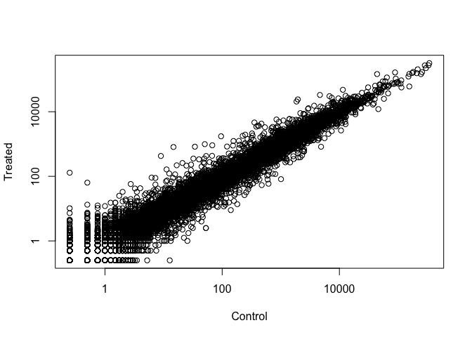
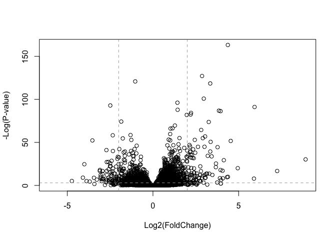
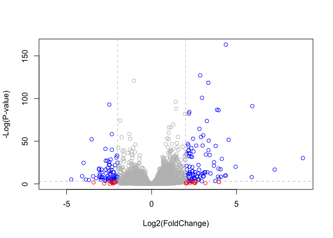
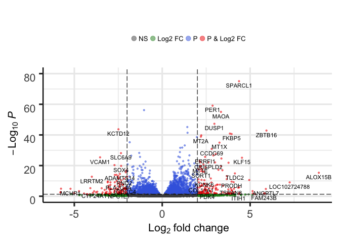

Class 14: Transcriptomics and the analysis of RNA-Seq data
================

The data for this hands-on session comes from a published RNA-seq experiment where airway smooth muscle cells were treated with dexamethasone, a synthetic glucocorticoid steroid with anti-inflammatory effects (Himes et al. 2014).

Glucocorticoids are used, for example, by people with asthma to reduce inflammation of the airways. The anti-inflammatory effects on airway smooth muscle (ASM) cells has been known for some time but the underlying molecular mechanisms are unclear.

Himes et al. used RNA-seq to profile gene expression changes in four different ASM cell lines treated with dexamethasone glucocorticoid. They found a number of differentially expressed genes comparing dexamethasone-treated to control cells, but focus much of the discussion on a gene called CRISPLD2. This gene encodes a secreted protein known to be involved in lung development, and SNPs in this gene in previous GWAS studies are associated with inhaled corticosteroid resistance and bronchodilator response in asthma patients. They confirmed the upregulated CRISPLD2 mRNA expression with qPCR and increased protein expression using Western blotting.

In the experiment, four primary human ASM cell lines were treated with 1 micromolar dexamethasone for 18 hours. For each of the four cell lines, we have a treated and an untreated sample. They did their analysis using Tophat and Cufflinks similar to our last day's hands-on session. For a more detailed description of their analysis see the PubMed entry 24926665 and for raw data see the GEO entry GSE52778.

In this session we will read and explore the gene expression data from this experiment using base R functions and then perform a detailed analysis with the DESeq2 package from Bioconductor.

Full instructions available online here: <https://bioboot.github.io/bggn213_S19/class-material/lab-14-bggn213.html>

``` r
# load the packages we need to use
library(BiocManager)
library(DESeq2)
```

    ## Loading required package: S4Vectors

    ## Loading required package: stats4

    ## Loading required package: BiocGenerics

    ## Loading required package: parallel

    ## 
    ## Attaching package: 'BiocGenerics'

    ## The following objects are masked from 'package:parallel':
    ## 
    ##     clusterApply, clusterApplyLB, clusterCall, clusterEvalQ,
    ##     clusterExport, clusterMap, parApply, parCapply, parLapply,
    ##     parLapplyLB, parRapply, parSapply, parSapplyLB

    ## The following objects are masked from 'package:stats':
    ## 
    ##     IQR, mad, sd, var, xtabs

    ## The following objects are masked from 'package:base':
    ## 
    ##     anyDuplicated, append, as.data.frame, basename, cbind,
    ##     colMeans, colnames, colSums, dirname, do.call, duplicated,
    ##     eval, evalq, Filter, Find, get, grep, grepl, intersect,
    ##     is.unsorted, lapply, lengths, Map, mapply, match, mget, order,
    ##     paste, pmax, pmax.int, pmin, pmin.int, Position, rank, rbind,
    ##     Reduce, rowMeans, rownames, rowSums, sapply, setdiff, sort,
    ##     table, tapply, union, unique, unsplit, which, which.max,
    ##     which.min

    ## 
    ## Attaching package: 'S4Vectors'

    ## The following object is masked from 'package:base':
    ## 
    ##     expand.grid

    ## Loading required package: IRanges

    ## Loading required package: GenomicRanges

    ## Loading required package: GenomeInfoDb

    ## Loading required package: SummarizedExperiment

    ## Loading required package: Biobase

    ## Welcome to Bioconductor
    ## 
    ##     Vignettes contain introductory material; view with
    ##     'browseVignettes()'. To cite Bioconductor, see
    ##     'citation("Biobase")', and for packages 'citation("pkgname")'.

    ## Loading required package: DelayedArray

    ## Loading required package: matrixStats

    ## 
    ## Attaching package: 'matrixStats'

    ## The following objects are masked from 'package:Biobase':
    ## 
    ##     anyMissing, rowMedians

    ## Loading required package: BiocParallel

    ## 
    ## Attaching package: 'DelayedArray'

    ## The following objects are masked from 'package:matrixStats':
    ## 
    ##     colMaxs, colMins, colRanges, rowMaxs, rowMins, rowRanges

    ## The following objects are masked from 'package:base':
    ## 
    ##     aperm, apply

countData and colData structure are very important to DESeq2 package; they must follow specific format in order to work properly

``` r
# read in the data files
counts <- read.csv("airway_scaledcounts.csv", stringsAsFactors = FALSE)
metadata <-  read.csv("airway_metadata.csv", stringsAsFactors = FALSE)
```

``` r
# look at the data files
head(counts)
```

    ##           ensgene SRR1039508 SRR1039509 SRR1039512 SRR1039513 SRR1039516
    ## 1 ENSG00000000003        723        486        904        445       1170
    ## 2 ENSG00000000005          0          0          0          0          0
    ## 3 ENSG00000000419        467        523        616        371        582
    ## 4 ENSG00000000457        347        258        364        237        318
    ## 5 ENSG00000000460         96         81         73         66        118
    ## 6 ENSG00000000938          0          0          1          0          2
    ##   SRR1039517 SRR1039520 SRR1039521
    ## 1       1097        806        604
    ## 2          0          0          0
    ## 3        781        417        509
    ## 4        447        330        324
    ## 5         94        102         74
    ## 6          0          0          0

``` r
head(metadata)
```

    ##           id     dex celltype     geo_id
    ## 1 SRR1039508 control   N61311 GSM1275862
    ## 2 SRR1039509 treated   N61311 GSM1275863
    ## 3 SRR1039512 control  N052611 GSM1275866
    ## 4 SRR1039513 treated  N052611 GSM1275867
    ## 5 SRR1039516 control  N080611 GSM1275870
    ## 6 SRR1039517 treated  N080611 GSM1275871

How many genes are in this dataset?

``` r
# either method acceptable, nrow is easiest way
summary(counts)
```

    ##    ensgene            SRR1039508         SRR1039509      
    ##  Length:38694       Min.   :     0.0   Min.   :     0.0  
    ##  Class :character   1st Qu.:     0.0   1st Qu.:     0.0  
    ##  Mode  :character   Median :     1.0   Median :     1.0  
    ##                     Mean   :   546.5   Mean   :   501.1  
    ##                     3rd Qu.:   203.0   3rd Qu.:   172.0  
    ##                     Max.   :287372.0   Max.   :244921.0  
    ##    SRR1039512         SRR1039513         SRR1039516       SRR1039517      
    ##  Min.   :     0.0   Min.   :     0.0   Min.   :     0   Min.   :     0.0  
    ##  1st Qu.:     0.0   1st Qu.:     0.0   1st Qu.:     0   1st Qu.:     0.0  
    ##  Median :     1.0   Median :     0.0   Median :     1   Median :     1.0  
    ##  Mean   :   673.6   Mean   :   405.3   Mean   :   649   Mean   :   822.5  
    ##  3rd Qu.:   237.0   3rd Qu.:   128.0   3rd Qu.:   228   3rd Qu.:   261.0  
    ##  Max.   :510107.0   Max.   :304818.0   Max.   :410979   Max.   :416837.0  
    ##    SRR1039520         SRR1039521      
    ##  Min.   :     0.0   Min.   :     0.0  
    ##  1st Qu.:     0.0   1st Qu.:     0.0  
    ##  Median :     1.0   Median :     1.0  
    ##  Mean   :   509.0   Mean   :   565.7  
    ##  3rd Qu.:   185.8   3rd Qu.:   183.0  
    ##  Max.   :378108.0   Max.   :372973.0

``` r
nrow(counts)
```

    ## [1] 38694

Check if the columns of "counts" is the same as the id column in "metadata"

``` r
colnames(counts)
```

    ## [1] "ensgene"    "SRR1039508" "SRR1039509" "SRR1039512" "SRR1039513"
    ## [6] "SRR1039516" "SRR1039517" "SRR1039520" "SRR1039521"

``` r
metadata$id
```

    ## [1] "SRR1039508" "SRR1039509" "SRR1039512" "SRR1039513" "SRR1039516"
    ## [6] "SRR1039517" "SRR1039520" "SRR1039521"

``` r
# gives column names of everything except the first column
# then check for equivalence with id in metadata
# then use all command and it will say if they are all true
all(colnames(counts)[-1] == metadata$id)
```

    ## [1] TRUE

How many "control" cell lines do we have in this dataset?

``` r
table(metadata$dex)
```

    ## 
    ## control treated 
    ##       4       4

There are 4 control lines in the dataset and 4 treated lines.

Differential expression analysis by hand
----------------------------------------

*Note: we will never actually do this for data analysis, but this is useful to understand how DESeq2 works*

We need to pull out all of the control samples and all of the treated samples into their own tables.

How do we make the code below more robust?

``` r
# access the control counts data only to calculate an average counts value for each gene
control <- metadata[metadata$dex=="control",]
```

Now get the cols in counts with these 'control$id' names

``` r
# original code with '4' hard-coded
# we could make this better so we don't have to change every time
# control.mean <- rowSums( counts[ ,control$id] )/4
control.mean <- rowSums( counts[ ,control$id] )/length(control$id)
head(control.mean)
```

    ## [1] 900.75   0.00 520.50 339.75  97.25   0.75

``` r
# add gene names from the counts
names(control.mean) <- counts$ensgene
head(control.mean)
```

    ## ENSG00000000003 ENSG00000000005 ENSG00000000419 ENSG00000000457 
    ##          900.75            0.00          520.50          339.75 
    ## ENSG00000000460 ENSG00000000938 
    ##           97.25            0.75

Now we need to do the same for the treated samples.

``` r
treated <- metadata[metadata$dex=="treated",]
treated.mean <- rowSums( counts[ ,treated$id] )/length(treated$id)
names(treated.mean) <- counts$ensgene
head(treated.mean)
```

    ## ENSG00000000003 ENSG00000000005 ENSG00000000419 ENSG00000000457 
    ##          658.00            0.00          546.00          316.50 
    ## ENSG00000000460 ENSG00000000938 
    ##           78.75            0.00

Create a data.frame with one column being the mean of controls and one column being the mean of the treated.

``` r
meancounts <- data.frame(control.mean, treated.mean)
head(meancounts)
```

    ##                 control.mean treated.mean
    ## ENSG00000000003       900.75       658.00
    ## ENSG00000000005         0.00         0.00
    ## ENSG00000000419       520.50       546.00
    ## ENSG00000000457       339.75       316.50
    ## ENSG00000000460        97.25        78.75
    ## ENSG00000000938         0.75         0.00

Let's plot this treated vs. control. If the drug has no effect, the line will be straight on the diagonal.

``` r
plot(meancounts[,1],meancounts[,2], xlab="Control", ylab="Treated")
```


We need to take the log of these expression values to get a more informative plot. Use the argument log="xy"

``` r
plot(meancounts[,1],meancounts[,2], xlab="Control", ylab="Treated", log="xy")
```

    ## Warning in xy.coords(x, y, xlabel, ylabel, log): 15032 x values <= 0
    ## omitted from logarithmic plot

    ## Warning in xy.coords(x, y, xlabel, ylabel, log): 15281 y values <= 0
    ## omitted from logarithmic plot



Add a column for log2 fold change onto the data.frame.

``` r
meancounts$log2fc <- log2(meancounts[,"treated.mean"]/meancounts[,"control.mean"])
head(meancounts)
```

    ##                 control.mean treated.mean      log2fc
    ## ENSG00000000003       900.75       658.00 -0.45303916
    ## ENSG00000000005         0.00         0.00         NaN
    ## ENSG00000000419       520.50       546.00  0.06900279
    ## ENSG00000000457       339.75       316.50 -0.10226805
    ## ENSG00000000460        97.25        78.75 -0.30441833
    ## ENSG00000000938         0.75         0.00        -Inf

There are a couple of “weird” results. Namely, the NaN ("not a number") and -Inf (negative infinity) results.

The NaN is returned when you divide by zero and try to take the log. The -Inf is returned when you try to take the log of zero. It turns out that there are a lot of genes with zero expression. Let’s filter our data to remove these genes.

``` r
# ask which values in 1st and 2nd columns are equal to zero
# will say which position(s) is/are true, in a vector format
# add 'arr.ind=TRUE' so it treats it as array indices
zero.vals <- which(meancounts[,1:2]==0, arr.ind=TRUE)

# now finds the rows where the first column is equal to zero
to.rm <- unique(zero.vals[,1])

# creates new data.frame with the zero value genes removed
mycounts <- meancounts[-to.rm,]
head(mycounts)
```

    ##                 control.mean treated.mean      log2fc
    ## ENSG00000000003       900.75       658.00 -0.45303916
    ## ENSG00000000419       520.50       546.00  0.06900279
    ## ENSG00000000457       339.75       316.50 -0.10226805
    ## ENSG00000000460        97.25        78.75 -0.30441833
    ## ENSG00000000971      5219.00      6687.50  0.35769358
    ## ENSG00000001036      2327.00      1785.75 -0.38194109

A common threshold used for calling something differentially expressed is a log2(FoldChange) of greater than 2 or less than -2. Let’s filter the dataset both ways to see how many genes are up or down-regulated.

``` r
# check which genes from the log2fc column are greater than 2 or less than -2 and assign them to a logical (T/F) vector
up.ind <- mycounts$log2fc > 2
down.ind <- mycounts$log2fc < (-2)
summary(up.ind)
```

    ##    Mode   FALSE    TRUE 
    ## logical   21567     250

``` r
summary(down.ind)
```

    ##    Mode   FALSE    TRUE 
    ## logical   21450     367

There are 250 genes that were upregulated (log2 fold change &gt; 2).

There are 367 genes that were downregulated (log2 fold change &lt; -2)

A total of 617 genes are dysregulated in the treated samples versus the control samples.

Add gene annotation data
------------------------

At the moment, we only have ENSEMBL IDs for each gene, which doesn't provide any useful biological insight. We want to merge this data with the counts data to see what types of genes were dysregulated.

``` r
anno <- read.csv("annotables_grch38.csv")
head(anno)
```

    ##           ensgene entrez   symbol chr     start       end strand
    ## 1 ENSG00000000003   7105   TSPAN6   X 100627109 100639991     -1
    ## 2 ENSG00000000005  64102     TNMD   X 100584802 100599885      1
    ## 3 ENSG00000000419   8813     DPM1  20  50934867  50958555     -1
    ## 4 ENSG00000000457  57147    SCYL3   1 169849631 169894267     -1
    ## 5 ENSG00000000460  55732 C1orf112   1 169662007 169854080      1
    ## 6 ENSG00000000938   2268      FGR   1  27612064  27635277     -1
    ##          biotype
    ## 1 protein_coding
    ## 2 protein_coding
    ## 3 protein_coding
    ## 4 protein_coding
    ## 5 protein_coding
    ## 6 protein_coding
    ##                                                                                                  description
    ## 1                                                          tetraspanin 6 [Source:HGNC Symbol;Acc:HGNC:11858]
    ## 2                                                            tenomodulin [Source:HGNC Symbol;Acc:HGNC:17757]
    ## 3 dolichyl-phosphate mannosyltransferase polypeptide 1, catalytic subunit [Source:HGNC Symbol;Acc:HGNC:3005]
    ## 4                                               SCY1-like, kinase-like 3 [Source:HGNC Symbol;Acc:HGNC:19285]
    ## 5                                    chromosome 1 open reading frame 112 [Source:HGNC Symbol;Acc:HGNC:25565]
    ## 6                          FGR proto-oncogene, Src family tyrosine kinase [Source:HGNC Symbol;Acc:HGNC:3697]

Use the **merge()** function to add annotation data to the 'mycounts' results.

``` r
mycounts.anno <- merge(x=mycounts, y=anno, by.x="row.names", by.y="ensgene")
head(mycounts.anno)
```

    ##         Row.names control.mean treated.mean      log2fc entrez   symbol
    ## 1 ENSG00000000003       900.75       658.00 -0.45303916   7105   TSPAN6
    ## 2 ENSG00000000419       520.50       546.00  0.06900279   8813     DPM1
    ## 3 ENSG00000000457       339.75       316.50 -0.10226805  57147    SCYL3
    ## 4 ENSG00000000460        97.25        78.75 -0.30441833  55732 C1orf112
    ## 5 ENSG00000000971      5219.00      6687.50  0.35769358   3075      CFH
    ## 6 ENSG00000001036      2327.00      1785.75 -0.38194109   2519    FUCA2
    ##   chr     start       end strand        biotype
    ## 1   X 100627109 100639991     -1 protein_coding
    ## 2  20  50934867  50958555     -1 protein_coding
    ## 3   1 169849631 169894267     -1 protein_coding
    ## 4   1 169662007 169854080      1 protein_coding
    ## 5   1 196651878 196747504      1 protein_coding
    ## 6   6 143494811 143511690     -1 protein_coding
    ##                                                                                                  description
    ## 1                                                          tetraspanin 6 [Source:HGNC Symbol;Acc:HGNC:11858]
    ## 2 dolichyl-phosphate mannosyltransferase polypeptide 1, catalytic subunit [Source:HGNC Symbol;Acc:HGNC:3005]
    ## 3                                               SCY1-like, kinase-like 3 [Source:HGNC Symbol;Acc:HGNC:19285]
    ## 4                                    chromosome 1 open reading frame 112 [Source:HGNC Symbol;Acc:HGNC:25565]
    ## 5                                                     complement factor H [Source:HGNC Symbol;Acc:HGNC:4883]
    ## 6                                          fucosidase, alpha-L- 2, plasma [Source:HGNC Symbol;Acc:HGNC:4008]

Use Bioconductor package AnnotationDbi
--------------------------------------

``` r
# load the packages
library("AnnotationDbi")
library("org.Hs.eg.db")
```

    ## 

This is the organism annotation package ("org") for Homo sapiens ("Hs"), organized as an AnnotationDbi database package ("db"), using Entrez Gene IDs ("eg") as primary key. To get a list of all available key types, use:

``` r
columns(org.Hs.eg.db)
```

    ##  [1] "ACCNUM"       "ALIAS"        "ENSEMBL"      "ENSEMBLPROT" 
    ##  [5] "ENSEMBLTRANS" "ENTREZID"     "ENZYME"       "EVIDENCE"    
    ##  [9] "EVIDENCEALL"  "GENENAME"     "GO"           "GOALL"       
    ## [13] "IPI"          "MAP"          "OMIM"         "ONTOLOGY"    
    ## [17] "ONTOLOGYALL"  "PATH"         "PFAM"         "PMID"        
    ## [21] "PROSITE"      "REFSEQ"       "SYMBOL"       "UCSCKG"      
    ## [25] "UNIGENE"      "UNIPROT"

Add column "symbol"

``` r
mycounts$symbol <- mapIds(org.Hs.eg.db,
                     keys=row.names(mycounts), # Our genenames
                     keytype="ENSEMBL",        # The format of our genenames
                     column="SYMBOL",          # The new format we want to add
                     multiVals="first")
```

    ## 'select()' returned 1:many mapping between keys and columns

Add column "entrez"

``` r
mycounts$entrez <- mapIds(org.Hs.eg.db,
                     keys=row.names(mycounts), # Our genenames
                     keytype="ENSEMBL",        # The format of our genenames
                     column="ENTREZID",          # The new format we want to add
                     multiVals="first")
```

    ## 'select()' returned 1:many mapping between keys and columns

Add column "uniprot"

``` r
mycounts$uniprot <- mapIds(org.Hs.eg.db,
                     keys=row.names(mycounts), # Our genenames
                     keytype="ENSEMBL",        # The format of our genenames
                     column="UNIPROT",          # The new format we want to add
                     multiVals="first")
```

    ## 'select()' returned 1:many mapping between keys and columns

Check 'mycounts' files to make sure the new columns were added properly.

``` r
head(mycounts)
```

    ##                 control.mean treated.mean      log2fc   symbol entrez
    ## ENSG00000000003       900.75       658.00 -0.45303916   TSPAN6   7105
    ## ENSG00000000419       520.50       546.00  0.06900279     DPM1   8813
    ## ENSG00000000457       339.75       316.50 -0.10226805    SCYL3  57147
    ## ENSG00000000460        97.25        78.75 -0.30441833 C1orf112  55732
    ## ENSG00000000971      5219.00      6687.50  0.35769358      CFH   3075
    ## ENSG00000001036      2327.00      1785.75 -0.38194109    FUCA2   2519
    ##                    uniprot
    ## ENSG00000000003 A0A024RCI0
    ## ENSG00000000419     O60762
    ## ENSG00000000457     Q8IZE3
    ## ENSG00000000460 A0A024R922
    ## ENSG00000000971 A0A024R962
    ## ENSG00000001036     Q9BTY2

Inspect upregulated genes

``` r
#View( mycounts[up.ind,] )
```

Inspect downregulated genes

``` r
#View( mycounts[down.ind,] )
```

DESeq2 Analysis
---------------

DESeq2 is an R package for analyzing count-based NGS data like RNA-seq. It is available from Bioconductor. Bioconductor is a project to provide tools for analyzing high-throughput genomic data including RNA-seq, ChIP-seq and arrays.

``` r
# load DESeq2 package
library(DESeq2)
citation("DESeq2")
```

    ## 
    ##   Love, M.I., Huber, W., Anders, S. Moderated estimation of fold
    ##   change and dispersion for RNA-seq data with DESeq2 Genome
    ##   Biology 15(12):550 (2014)
    ## 
    ## A BibTeX entry for LaTeX users is
    ## 
    ##   @Article{,
    ##     title = {Moderated estimation of fold change and dispersion for RNA-seq data with DESeq2},
    ##     author = {Michael I. Love and Wolfgang Huber and Simon Anders},
    ##     year = {2014},
    ##     journal = {Genome Biology},
    ##     doi = {10.1186/s13059-014-0550-8},
    ##     volume = {15},
    ##     issue = {12},
    ##     pages = {550},
    ##   }

You can construct a DESeqDataSet from (1) a count matrix, (2) a metadata file, and (3) a formula indicating the design of the experiment.

We will use the DESeqDataSetFromMatrix() function to build the required DESeqDataSet object and call it dds, short for our DESeqDataSet.

``` r
# build the DESeq dataset object
dds <- DESeqDataSetFromMatrix(countData=counts, 
                              colData=metadata, 
                              design=~dex, 
                              tidy=TRUE)
```

    ## converting counts to integer mode

    ## Warning in DESeqDataSet(se, design = design, ignoreRank): some variables in
    ## design formula are characters, converting to factors

``` r
dds
```

    ## class: DESeqDataSet 
    ## dim: 38694 8 
    ## metadata(1): version
    ## assays(1): counts
    ## rownames(38694): ENSG00000000003 ENSG00000000005 ...
    ##   ENSG00000283120 ENSG00000283123
    ## rowData names(0):
    ## colnames(8): SRR1039508 SRR1039509 ... SRR1039520 SRR1039521
    ## colData names(4): id dex celltype geo_id

``` r
dds <- DESeq(dds)
```

    ## estimating size factors

    ## estimating dispersions

    ## gene-wise dispersion estimates

    ## mean-dispersion relationship

    ## final dispersion estimates

    ## fitting model and testing

Get the results

``` r
res <- results(dds)
#as.data.frame(res)
```

``` r
summary(res)
```

    ## 
    ## out of 25258 with nonzero total read count
    ## adjusted p-value < 0.1
    ## LFC > 0 (up)       : 1564, 6.2%
    ## LFC < 0 (down)     : 1188, 4.7%
    ## outliers [1]       : 142, 0.56%
    ## low counts [2]     : 9971, 39%
    ## (mean count < 10)
    ## [1] see 'cooksCutoff' argument of ?results
    ## [2] see 'independentFiltering' argument of ?results

``` r
# Apply more stringent cutoff for adjusted p-value.
res05 <- results(dds, alpha =0.05)
summary(res05)
```

    ## 
    ## out of 25258 with nonzero total read count
    ## adjusted p-value < 0.05
    ## LFC > 0 (up)       : 1237, 4.9%
    ## LFC < 0 (down)     : 933, 3.7%
    ## outliers [1]       : 142, 0.56%
    ## low counts [2]     : 9033, 36%
    ## (mean count < 6)
    ## [1] see 'cooksCutoff' argument of ?results
    ## [2] see 'independentFiltering' argument of ?results

Make a volcano plot by plotting log fold change on the x-axis and the p-value on the y-axis.

``` r
plot( res$log2FoldChange,  -log(res$padj), 
      xlab="Log2(FoldChange)",
      ylab="-Log(P-value)")
```


Make the plot a little more informative by adding ablines at p-value of 0.05 and at log fold change of +/-2.

``` r
plot( res$log2FoldChange,  -log(res$padj), 
 ylab="-Log(P-value)", xlab="Log2(FoldChange)")

# Add some cut-off lines
abline(v=c(-2,2), col="darkgray", lty=2)
abline(h=-log(0.05), col="darkgray", lty=2)
```



Add color to distinguish the upregulated and downreglated genes that also meet our significance cutoffs. Blue points satisfy both conditions (i.e. highly dysregulated and also make p-value cutoff) while red points are highly dysregulated but don't meet p-value significance threshold.

``` r
# Setup our custom point color vector
# repeat color gray for the number of rows of results
mycols <- rep("gray", nrow(res))
# then overwrite the grays for red points that have an absolute value log2fold change >2
mycols[ abs(res$log2FoldChange) > 2 ]  <- "red" 

#finally overwrite reds for blue points that reach a padj value < 0.05
inds <- (res$padj < 0.05) & (abs(res$log2FoldChange) > 2 )
mycols[ inds ] <- "blue"

# Generate the volcano plot with custom colors 'mycols'
plot( res$log2FoldChange,  -log(res$padj), 
 col=mycols, ylab="-Log(P-value)", xlab="Log2(FoldChange)" )

# Add the cut-off lines
abline(v=c(-2,2), col="gray", lty=2)
abline(h=-log(0.05), col="gray", lty=2)
```



Visualization with EnhancedVolcano package
------------------------------------------

``` r
library(EnhancedVolcano)
```

    ## Loading required package: ggplot2

    ## Loading required package: ggrepel

First we will add the more understandable gene symbol names to our full results object res as we will use this to label the most interesting genes in our final plot.

``` r
x <- as.data.frame(res)
x$symbol <- mapIds(org.Hs.eg.db, 
                   keys=row.names(x),
                   keytype="ENSEMBL",
                   column="SYMBOL",
                   multiVals="first")
```

    ## 'select()' returned 1:many mapping between keys and columns

``` r
# generate the plot
EnhancedVolcano(x,
    lab = x$symbol,
    x = 'log2FoldChange',
    y = 'pvalue')
```

    ## Warning: Removed 13578 rows containing missing values (geom_point).

    ## Warning: Removed 24 rows containing missing values (geom_text).



The sessionInfo() prints version information about R and any attached packages. It's a good practice to always run this command at the end of an R session and record it for the sake of reproducibility in the future.

``` r
sessionInfo()
```

    ## R version 3.5.2 (2018-12-20)
    ## Platform: x86_64-apple-darwin15.6.0 (64-bit)
    ## Running under: macOS Mojave 10.14.4
    ## 
    ## Matrix products: default
    ## BLAS: /Library/Frameworks/R.framework/Versions/3.5/Resources/lib/libRblas.0.dylib
    ## LAPACK: /Library/Frameworks/R.framework/Versions/3.5/Resources/lib/libRlapack.dylib
    ## 
    ## locale:
    ## [1] en_US.UTF-8/en_US.UTF-8/en_US.UTF-8/C/en_US.UTF-8/en_US.UTF-8
    ## 
    ## attached base packages:
    ## [1] parallel  stats4    stats     graphics  grDevices utils     datasets 
    ## [8] methods   base     
    ## 
    ## other attached packages:
    ##  [1] EnhancedVolcano_1.0.1       ggrepel_0.8.0              
    ##  [3] ggplot2_3.1.0               org.Hs.eg.db_3.7.0         
    ##  [5] AnnotationDbi_1.44.0        DESeq2_1.20.0              
    ##  [7] SummarizedExperiment_1.12.0 DelayedArray_0.8.0         
    ##  [9] BiocParallel_1.16.6         matrixStats_0.54.0         
    ## [11] Biobase_2.42.0              GenomicRanges_1.34.0       
    ## [13] GenomeInfoDb_1.18.2         IRanges_2.16.0             
    ## [15] S4Vectors_0.20.1            BiocGenerics_0.28.0        
    ## [17] BiocManager_1.30.4         
    ## 
    ## loaded via a namespace (and not attached):
    ##  [1] bit64_0.9-7            splines_3.5.2          Formula_1.2-3         
    ##  [4] assertthat_0.2.0       latticeExtra_0.6-28    blob_1.1.1            
    ##  [7] GenomeInfoDbData_1.2.0 yaml_2.2.0             pillar_1.3.1          
    ## [10] RSQLite_2.1.1          backports_1.1.3        lattice_0.20-38       
    ## [13] glue_1.3.0             digest_0.6.18          RColorBrewer_1.1-2    
    ## [16] XVector_0.22.0         checkmate_1.9.1        colorspace_1.4-0      
    ## [19] htmltools_0.3.6        Matrix_1.2-15          plyr_1.8.4            
    ## [22] XML_3.98-1.17          pkgconfig_2.0.2        genefilter_1.62.0     
    ## [25] zlibbioc_1.28.0        purrr_0.3.2            xtable_1.8-4          
    ## [28] scales_1.0.0           htmlTable_1.13.1       tibble_2.0.1          
    ## [31] annotate_1.58.0        withr_2.1.2            nnet_7.3-12           
    ## [34] lazyeval_0.2.1         survival_2.43-3        magrittr_1.5          
    ## [37] crayon_1.3.4           memoise_1.1.0          evaluate_0.13         
    ## [40] foreign_0.8-71         tools_3.5.2            data.table_1.12.0     
    ## [43] stringr_1.4.0          locfit_1.5-9.1         munsell_0.5.0         
    ## [46] cluster_2.0.7-1        compiler_3.5.2         rlang_0.3.1           
    ## [49] grid_3.5.2             RCurl_1.95-4.11        rstudioapi_0.9.0      
    ## [52] htmlwidgets_1.3        labeling_0.3           bitops_1.0-6          
    ## [55] base64enc_0.1-3        rmarkdown_1.11         gtable_0.2.0          
    ## [58] DBI_1.0.0              R6_2.4.0               gridExtra_2.3         
    ## [61] knitr_1.21             dplyr_0.8.0.1          bit_1.1-14            
    ## [64] Hmisc_4.2-0            stringi_1.3.1          Rcpp_1.0.1            
    ## [67] geneplotter_1.58.0     rpart_4.1-13           acepack_1.4.1         
    ## [70] tidyselect_0.2.5       xfun_0.5
