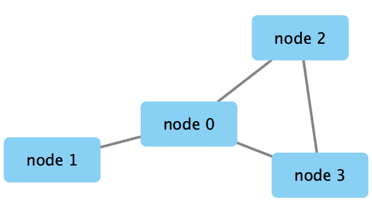
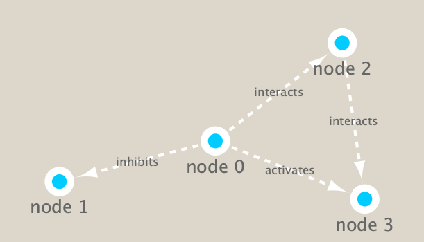

```{r setup, include=FALSE}
knitr::opts_chunk$set(echo = TRUE)
```

## Metagenomics co-occurence networks

Full instructions available online here: https://bioboot.github.io/bggn213_S19/class-material/lecture17_BGGN213_S19_new.html


Many projects have collected samples from different regions and from different depths of the ocean. Some, such as the pioneering study by Craig Venter (Venter et al. 2004) have pioneered metagenomic sequencing and others, such as Tara Oceans Expedition have collected large amounts of data with global ecological questions in mind. On the Tara Oceans (8th and 9th expedition for this vessel) researchers used a small sailboat outfitted with a lab and filtration supplies to collect samples from many different size fractions of microorganisms in the oceans over three years. They collected these samples to look at the different kinds of microorganisms present in different parts of the oceans to look at their composition and to observe their spatial patterns and distribution.

The scientists collected the samples and then used either targeted sequencing (amplicon approach using primers for specific targets such as the ribosomal genes and then amplifying these targets using PCR) or using metagenomic sequencing (where all the genetic material in a sample is sequenced) of each of the size fractions.

After the sequencing and quality checking of the samples was done, the sequences were taxonomically classified (different approaches for the different targets, see here for the details in Brum et al. (2015) and Sunagawa et al. (2015)). After that the data could be made into a species occurrence table where the rows are different sites and the columns are the observations of the different organisms at each site (Lima-Mendez et al. 2015).

In this analysis we are using a Tara Ocean data and we have data from the bacterial dataset (Sunagawa et al. 2015) and also from the viral dataset (Brum et al. 2015). They have been examined in Lima-Mendez et al. (2015) and we have used the original relative abundances to visualize the data. Data were retrieved from: http://www.raeslab.org/companion/ocean-interactome.html

## Set up Cytoscape and R connection

```{r}
library(RCy3)
library(igraph)
library(RColorBrewer)
```


```{r}
# Test the connection to Cytoscape.
cytoscapePing()
```

If there are issues connecting to Cytoscape, restart the program and ensure that incoming connections are enabled in the dialogue box.

```{r}
# Check the version
cytoscapeVersionInfo()
```

```{r}
g <- makeSimpleIgraph()
createNetworkFromIgraph(g,"myGraph")
```

Include the Cytoscape rendered network image in the report with the following code:

```{r}
fig <- exportImage(filename="demo", type="png", height=350)

```

## Switch network style

```{r}
setVisualStyle("Marquee")
```

```{r}
fig <- exportImage(filename="demo_marquee", type="png", height=350)

```

What other styles are available to try?

```{r}
styles <- getVisualStyleNames()
styles
```

```{r}
# these styles now commented out after visualizing them in Cytoscape
#setVisualStyle(styles[13])
#setVisualStyle(styles[18])
```

## Read the Metagenomics Data

We will read in a species co-occurrence matrix that was calculated using Spearman Rank coefficient. (see reference Lima-Mendez et al. (2015) for details).

```{r}
prok_vir_cor <- read.delim("./virus_prok_cor_abundant.tsv", stringsAsFactors = FALSE)
head(prok_vir_cor)
```

We will now use the **igraph package** to convert the co-occurrence dataframe into a network that we can send to Cytoscape. In this case our graph is undirected (so we will set directed = FALSE) since we do not have any information about the direction of the interactions from this type of data.

```{r}
g <- graph.data.frame(prok_vir_cor, directed = FALSE)
```


```{r}
class(g)
```

```{r}
g
```

In this case the first line of output ("UNW- 854 1544 --") tells that our network graph has 845 vertices (i.e. nodes, which represent our bacteria and viruses) and 1544 edges (i.e. linking lines, which indicate their co-occurrence). Note that the first four characters (i.e. the "UNW-" part) tell us about the network setup. In this case our network is Undirected, Named (i.e. has the 'name' node/vertex attribute set) and Weighted (i.e. the 'weight' edge attribute is set).

```{r}
plot(g)
```


This plot needs to be cleaned up -- it is too dense.

```{r}
# removes the blue labels on the graph
plot(g, vertex.label=NA)
```

The nodes/vertex are still too big. Make them smaller.

```{r}
# set vertex size
plot(g, vertex.size=3, vertex.label=NA)
```

## Using the ggplot extension ggraph


```{r}
library(ggraph)
```


```{r}
ggraph(g, layout = 'auto') +
  geom_edge_link(alpha = 0.25) +
  geom_node_point(color="steelblue") +
  theme_graph()
```

Can send this graph to Cytoscape using the following command:

```{r}
createNetworkFromIgraph(g,"myIgraph")
```

## Network Querys

We can query (and set) vertex and edge attributes with the **V()** and **E()** functions.

```{r}
# Vertices
V(g)
```

```{r}
# Edges
E(g)
```

There are also the functions **vertex.attributes()** and **edge.attributes()** that query all vertex and edge attributes of an igraph object.

## Network Community Detection

Community structure detection algorithms try to find dense subgraphs within larger network graphs (i.e. clusters of well connected nodes that are densely connected themselves but sparsely connected to other nodes outside the cluster) . Here we use the classic Girvan & Newman betweenness clustering method. The igraph package has lots of different community detection algorithms (i.e. different methods for finding communities).

```{r}
# Girvan and Newman
cb <- cluster_edge_betweenness(g)
```

```{r}
cb
```

```{r}
plot(cb, y=g, vertex.label=NA,  vertex.size=3)
```

Extract a cluster/community membership vector for further inspection with the **membership()** function.

```{r}
head( membership(cb) )
```

## Node Degree

The degree of a node or vertex is its most basic structural property, the number of its adjacent edges. Here we calculate and plot the node degree distribution.

```{r}
# Calculate and plot node degree of our network
d <- degree(g)
hist(d, breaks=30, col="lightblue", main ="Node Degree Distribution")
```

For the **degree_distribution()** function a numeric vector of the same length as the maximum degree plus one is returned. The first element is the relative frequency zero degree vertices, the second vertices with degree one, etc.

```{r}
plot( degree_distribution(g), type="h" )
```


## Centrality Analysis

Centrality gives an estimation on how important a node or edge is for the connectivity (or the information flow) of a network. It is a particularly useful parameter in signaling networks and it is often used when trying to find drug targets for example.

Centrality analysis often aims to answer the following question: Which nodes are the most important and why?

One centrality method that you can often find in publications is the Google PageRank score:

```{r}
pr <- page_rank(g)
head(pr$vector)
```

Plot the network with nodes size scaled via this page rank centrality scores.

```{r}
# Make a size vector btwn 2 and 20 for node plotting size

v.size <- BBmisc::normalize(pr$vector, range=c(2,20), method="range")
plot(g, vertex.size=v.size, vertex.label=NA)
```

One of the simplest centrality scores is of course degree that we calculated previously and stored as the object d. Plot this one too:

```{r}
v.size <- BBmisc::normalize(d, range=c(2,20), method="range")
plot(g, vertex.size=v.size, vertex.label=NA)
```

Another very common centrality score is betweenness. The vertex and edge betweenness are (roughly) defined by the number of geodesics (shortest paths) going through a vertex or an edge.

```{r}
b <- betweenness(g)
v.size <- BBmisc::normalize(b, range=c(2,20), method="range")
plot(g, vertex.size=v.size, vertex.label=NA)
```

## Read taxonomic classification for network annotation

Since these are data from small, microscopic organisms that were sequenced using shotgun sequencing, we rely on the classification of the sequences to know what kind of organisms are in the samples. In this case the bacterial viruses (bacteriophage), were classified by Basic Local Alignment Search Tool (BLAST http://blast.ncbi.nlm.nih.gov/Blast.cgi) by searching for their closest sequence in the RefSeq database (see methods in Brum et al. (2015)). The prokaryotic taxonomic classifications were determined using the SILVA database.

```{r}
phage_id_affiliation <- read.delim("./phage_ids_with_affiliation.tsv")
head(phage_id_affiliation)
```

```{r}
bac_id_affi <- read.delim("./prok_tax_from_silva.tsv", stringsAsFactors = FALSE)
head(bac_id_affi)
```

## Add taxonomic annotation data to network

```{r}
## Extract out our vertex names
genenet.nodes <- as.data.frame(vertex.attributes(g), stringsAsFactors=FALSE)
head(genenet.nodes)
```

How may phage (i.e. ph_) entries do we have?

```{r}
length( grep("^ph_",genenet.nodes[,1]) )
```

There are 764 phage entries, which means there are 81 that are non-phage.

Now we need to **merge()** these with the annotation data before we load into Cytoscape.

```{r}
# We dont need all annotation data so lets make a reduced table 'z' for merging
z <- bac_id_affi[,c("Accession_ID", "Kingdom", "Phylum", "Class")]
n <- merge(genenet.nodes, z, by.x="name", by.y="Accession_ID", all.x=TRUE)
head(n)
```

Now we have the sample name (accession ID) appended to information about each organism's Kingdom, Phylum, and Class.

```{r}
# Check on the column names before deciding what to merge
colnames(n)
# alternatively, can just use view() function or R environment window
```

```{r}
colnames(phage_id_affiliation)
```

```{r}
# Again we only need a subset of `phage_id_affiliation` for our purposes
y <- phage_id_affiliation[, c("first_sheet.Phage_id_network", "phage_affiliation","Tax_order", "Tax_subfamily")]

# Add the little phage annotation that we have
x <- merge(x=n, y=y, by.x="name", by.y="first_sheet.Phage_id_network", all.x=TRUE)

## Remove duplicates from multiple matches
x <- x[!duplicated( (x$name) ),]
head(x)
```

Save this to a more descriptive variable.

```{r}
genenet.nodes <- x
```

## Send network to Cytoscape using RCy3

Before doing anything else, delete any windows and networks that were already open in Cytoscape. This will clean the slate and help ensure we don't use up all of our memory.

```{r}
# Open a new connection and delete any existing windows/networks in Cy
deleteAllNetworks()
```

Can look in Cytoscape window and see that it worked.

We will need to set the first column in our node data.frame to id as this is what the RCy3 function **createNetworkFromDataFrames()** expects. Note that additional columns are loaded into Cytoscape as node attributes.

Likewise the edge data.frame should contain columns of character strings named: source, target and interaction (with additional columns loaded as edge attributes).

```{r}
# Set the main nodes colname to the required "id" 
colnames(genenet.nodes)[1] <- "id"
```

Now we will add to the network the data related to the connections between the organisms, the edge data, and then send the nodes and edges data.frames to Cytoscape using the function **createNetworkFromDataFrames()**

```{r}
genenet.edges <- data.frame(igraph::as_edgelist(g))

# Set the main edges colname to the required "source" and "target" 
colnames(genenet.edges) <- c("source","target")

# Add the weight from igraph to a new column...
genenet.edges$Weight <- igraph::edge_attr(g)$weight

# Send as a new network to Cytoscape
createNetworkFromDataFrames(genenet.nodes,genenet.edges, 
                            title="Tara_Oceans")
```

The network is now visible in Cytoscape.
